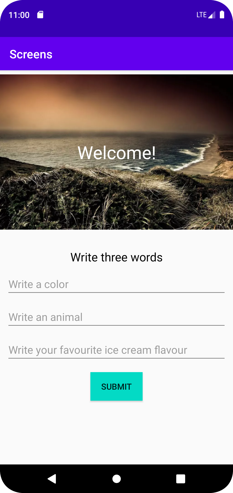
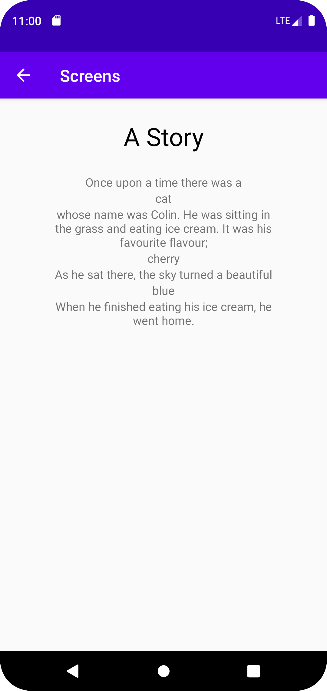

# Rapport

I denna uppgift skapades en app med två activities. Den ena, main activity, hade en bild, lite text, tre edit texts och en knapp.
Meningen var att användaren skulle fylla i rutorna med en färg, en smak och ett djur. Dessa skulle sedan skickas till den andra acitivtyn och läggas in i en berättelse när användaren klickade på knappen.
För att skicka med datan användes intent och tre olika putExtra för att få med all data.

```
sumbitBtn.setOnClickListener(new View.OnClickListener() {
@Override
public void onClick(View view) {
                Intent intent = new Intent(MainActivity.this, DisplayActivity.class);
                intent.putExtra("text1", textbox1.getText().toString());
                intent.putExtra("text2", textbox2.getText().toString());
                intent.putExtra("text3", textbox3.getText().toString());
                startActivity(intent);
            }
        });
```

Det togs sen emot i display activity och sattes i varsin textview. 
```
        Intent intent = getIntent();
        Bundle extras = intent.getExtras(); 

        String colourText = extras.getString("text1");
        String animalText = extras.getString("text2");
        String flavourText = extras.getString("text3");

        animalBox.setText(animalText);
        colourBox.setText(colourText);
        flavourBox.setText(flavourText);
```

Hemskärmen för appen, med tre textboxes som användaren kan fylla i. 


Den andra skärmen, som visar upp berättelsen med användarens inskrivna ord.

